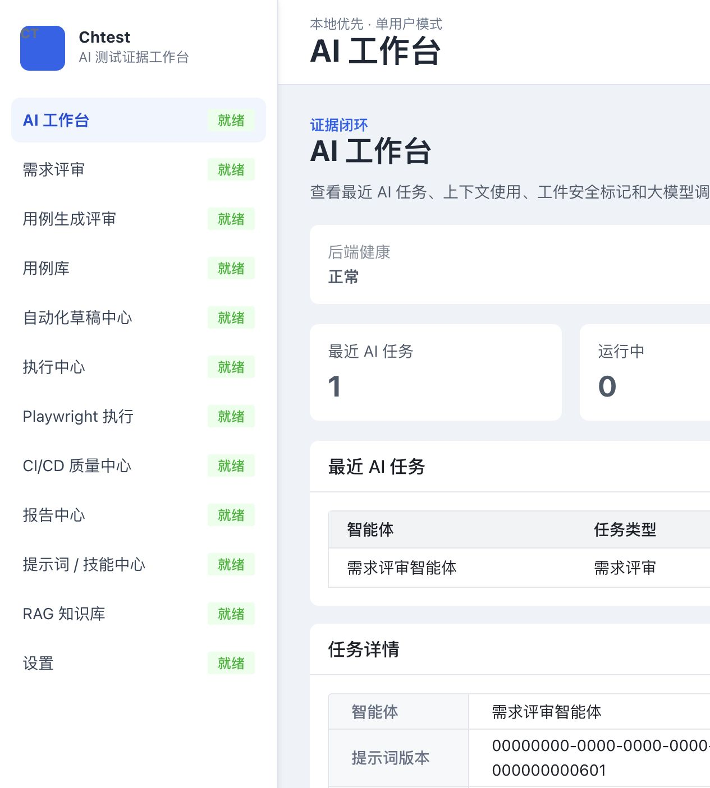
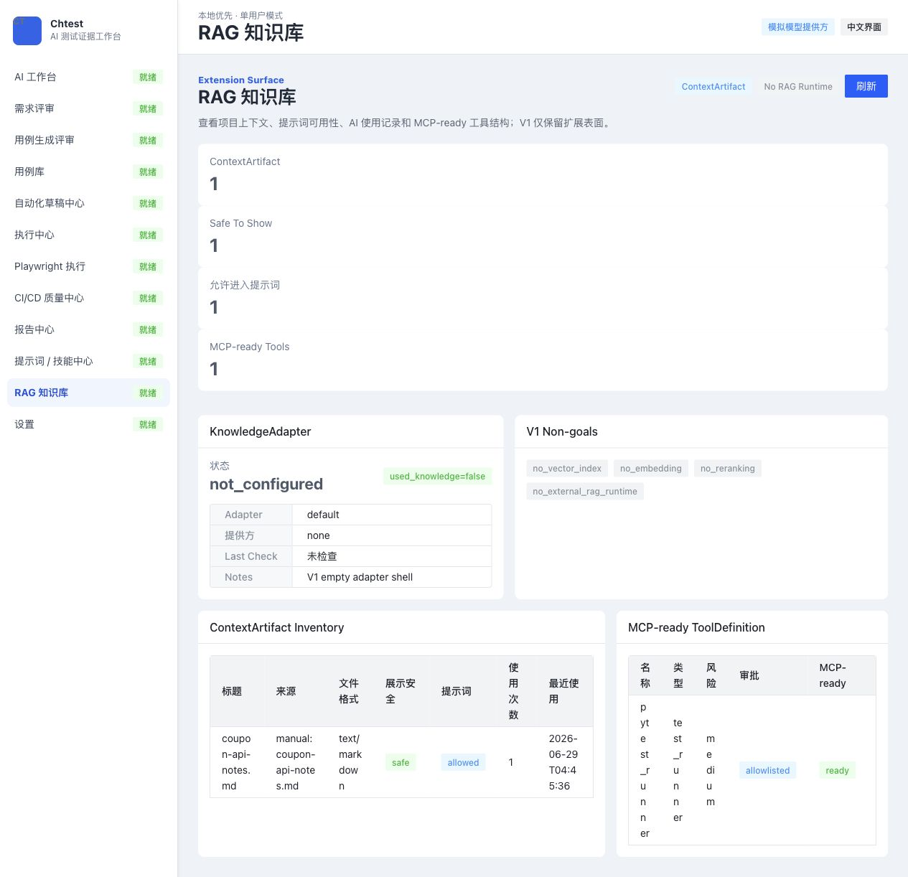
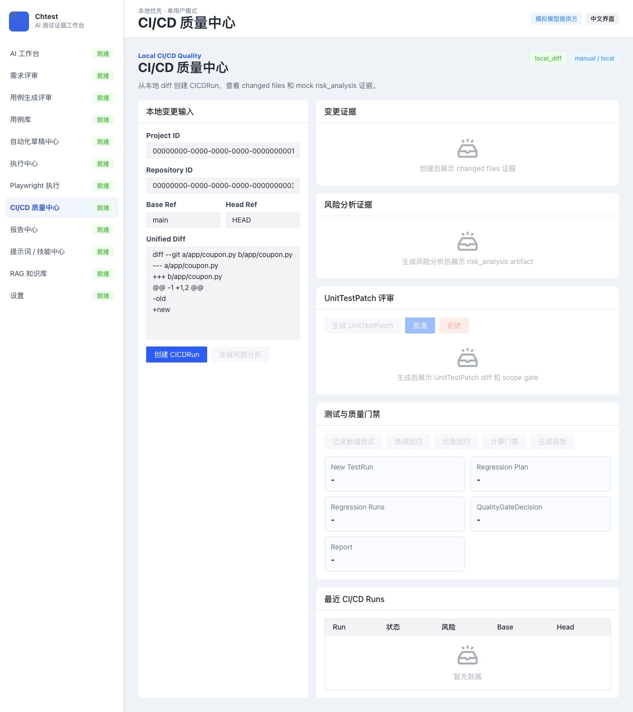
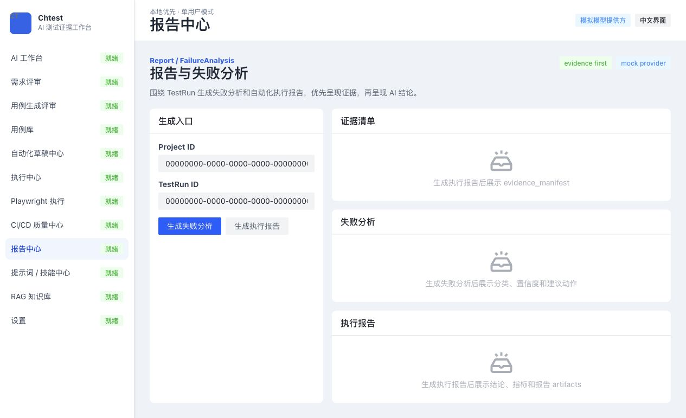

<div align="center">

# Chtest

## 让 AI 生成的每一条测试结论，都有审查、有执行、有证据

**面向测试工程师的本地优先 AI 测试证据工作台**

从需求风险分析、用例设计、自动化生成，到受控执行、失败诊断和质量报告，
Chtest 将零散的 AI 能力组织成一条可复核、可追溯的测试闭环。

[](https://www.python.org/)
[](https://fastapi.tiangolo.com/)
[](https://vuejs.org/)
[](https://www.typescriptlang.org/)
[](https://www.postgresql.org/)
[](https://docs.docker.com/compose/)

[产品优势](#为什么选择-chtest) · [测试闭环](#一条真正闭环的-ai-测试链路) · [界面预览](#产品界面) · [快速开始](#快速开始)

</div>



## 测试工作的难点，不是再生成一批内容

AI 可以快速生成用例和代码，但真实测试工作还必须回答：

- **为什么测？** 这条用例覆盖了哪个需求、风险或代码变更？
- **凭什么信？** AI 使用了什么上下文，输出是否经过结构校验和人工审查？
- **能不能跑？** 自动化脚本是否获批，执行环境和命令是否受控？
- **结果可靠吗？** 通过或失败的结论，能否追溯到日志、产物和运行记录？
- **下一步做什么？** 失败后如何定位，覆盖缺口如何补齐，经验如何沉淀？

Chtest 的目标不是替代测试工程师做判断，而是让测试工程师更早发现风险、更快形成资产，并用证据做出更可信的质量决策。

## 为什么选择 Chtest

| 常见 AI 测试工具 | Chtest 的产品选择 | 带来的测试价值 |
| :--- | :--- | :--- |
| 生成一次即结束 | 从需求分析贯通到报告与知识反馈 | 减少工具切换和测试资产断点 |
| 只展示最终答案 | 记录 AI 使用的模型、项目资料和生成过程 | 结论可解释，问题可复盘 |
| AI 输出直接进入下游 | 用例、自动化脚本和测试补丁都需要人工确认 | 保留测试人员的判断权，降低误执行风险 |
| 报告与执行记录分离 | 报告结论必须关联运行记录、日志和测试产物 | 让通过、失败和发布建议有据可查 |
| 项目经验难以复用 | 关联需求、风险、用例、执行结果和测试知识 | 支持覆盖检查、影响分析和回归建议 |
| 依赖单一云模型或平台 | 支持本地体验，AI 模型和知识服务可以替换 | 降低数据外发和厂商锁定成本 |

### 对不同角色的直接价值

| 角色 | 使用 Chtest 后可以获得什么 |
| :--- | :--- |
| 功能测试工程师 | 从需求中提取风险与测试点，审查 AI 候选用例，减少遗漏并保留判断过程 |
| 自动化测试工程师 | 将已审查用例转成可编辑、需审批的自动化草稿，并统一查看执行证据 |
| 测试负责人 | 从覆盖情况、人工确认、执行结果和报告依据判断质量，而不是只看一个“通过率”数字 |
| 研发与质量协作者 | 对本地代码变更进行风险分析、补充限定范围的单测，并获得有依据的质量建议 |

## 一条真正闭环的 AI 测试链路

```text
需求 / 本地代码变更
        |
        v
AI 需求审查与风险识别 -----> 测试知识与项目上下文
        |
        v
候选用例生成与质量检查
        |
        v
人工审查、编辑、批准
        |
        v
自动化草稿 / 单元测试补丁
        |
        v
人工审批 + 受控执行
        |
        v
运行结果 + 日志 + 测试产物 + 环境信息
        |
        v
失败分析 + 测试报告 + 质量建议
        |
        v
经审查的测试知识反馈
```

这条链路把三个经常断开的环节连接起来：

1. **风险到覆盖**：每条候选用例说明覆盖的需求、风险、生成原因以及是否适合自动化。
2. **资产到执行**：只有经过审查的用例与自动化草稿才能进入后续流程。
3. **执行到决策**：运行结果、日志、环境和证据清单共同支撑报告结论。

## 典型使用场景

### 需求评审后，快速形成可审查的测试方案

导入需求和项目上下文，识别边界、异常路径与高风险点，生成候选用例。测试人员可以逐条编辑、批准或拒绝，最终资产保留完整来源和审查记录。

### 从已批准用例推进自动化，而不是直接执行 AI 代码

基于正式用例生成 pytest 或 Playwright 草稿，检查代码、目标路径、运行说明和风险提示。只有人工批准后，草稿才能进入受控执行。

### 用证据解释一次失败，而不只是展示红色状态

将运行结果、输出日志、错误信息、运行环境和测试产物关联到失败分析与报告，帮助测试人员判断是产品缺陷、环境问题还是自动化脚本问题。

### 在提交代码前评估本地变更风险

读取本地代码变更，分析受影响范围，生成限定范围的单元测试，运行新增测试与回归测试，并基于实际结果给出质量建议。

## 产品界面

### 测试知识工作台：让项目经验参与生成，也接受人工治理

Chtest 将项目文档和历史测试经验整理成可审查的知识卡片，记录来源、适用范围和使用情况，让 AI 在生成测试内容时获得更准确的项目背景。



<table>
  <tr>
    <td width="50%">
      <strong>CI/CD 质量中心</strong><br><br>
      从本地代码变更、风险分析、测试补丁到回归结果与质量建议。<br><br>
      
    </td>
    <td width="50%">
      <strong>报告中心</strong><br><br>
      将测试结论与运行记录、日志、测试产物和失败分析关联起来。<br><br>
      
    </td>
  </tr>
</table>

## 核心能力

| 工作域 | 核心能力 | 价值输出 |
| :--- | :--- | :--- |
| 需求与风险 | 需求审查、风险项、上下文引用 | 可解释的测试重点与风险清单 |
| 用例工程 | 候选生成、质量检查、覆盖缺口、人工评审、用例库 | 可维护、可追溯的正式测试资产 |
| 自动化工程 | pytest / Playwright 草稿、编辑、审批、执行 | 从用例到自动化的受控转化 |
| 多类型执行 | pytest、Playwright、Newman、JMeter 工作流 | 统一的运行记录与执行入口 |
| 证据与报告 | 运行记录、测试结果、测试产物、失败分析 | 可复核的测试结论 |
| 代码变更质量 | 变更风险、单元测试补充、回归执行、质量建议 | 面向本地变更的质量决策 |
| 测试知识 | 资料导入、内容审查、知识查找、关联分析、经验沉淀 | 可管理、可复用的项目测试经验 |
| AI 使用记录 | 模型信息、输入资料、生成结果、人工决策 | 可追溯的 AI 使用过程 |

## 可信测试，不靠一句“AI 说通过了”

Chtest 把安全与可信控制放进工作流，而不是只写在使用说明里：

- AI 输出必须经过系统检查才能用于后续步骤。
- 未批准的候选用例不能进入正式用例库。
- 未批准的自动化脚本不能执行。
- AI 生成的测试补丁不能修改业务代码。
- 测试命令受系统限制，不能执行任意命令。
- 报告缺少证据清单时，不能给出“测试通过”结论。
- 不安全、包含秘密或未获批准的知识不能参与最终生成。
- 每个关键步骤都保留人工操作和结果记录。

Chtest 坚持本地优先和人工把关，AI 不会绕过测试人员直接执行高风险操作。

## 技术栈

| 层级 | 技术 |
| :--- | :--- |
| 前端 | Vue 3、TypeScript、Vite、Pinia、Vue Router、Arco Design Vue |
| 后端 | Python 3.12、FastAPI、SQLAlchemy |
| 数据与任务 | PostgreSQL 16、Redis 7 |
| 测试执行 | pytest、Playwright、Newman、JMeter |
| 工程与验证 | Docker Compose、Vitest、pytest、uv |

## 快速开始

### 环境要求

- Git
- Docker Desktop 或 Docker Engine
- Docker Compose v2

### 1. 克隆并创建配置

```bash
git clone https://github.com/YanChen0111/Chtest.git
cd Chtest
cp .env.example .env
```

Windows PowerShell：

```powershell
Copy-Item .env.example .env
```

默认配置提供本地模拟 AI，无需 API Key 即可体验完整流程。需要使用真实 AI 模型时，可在环境配置中填写服务地址、密钥和模型名称。

### 2. 启动工作台

```bash
docker compose --env-file .env -f deploy/docker-compose.yml up --build
```

### 3. 打开服务

- 前端工作台：<http://localhost:5173>
- 后端 API：<http://localhost:8000>
- API 文档：<http://localhost:8000/docs>
- 健康检查：<http://localhost:8000/health>

首次启动需要下载镜像和安装依赖，请等待各项服务准备完成。

停止服务：

```bash
docker compose --env-file .env -f deploy/docker-compose.yml down
```

## 验证项目

后端测试：

```powershell
backend\.venv\Scripts\python.exe -m pytest backend/app/tests -q
```

前端测试与生产构建：

```bash
npm --prefix frontend install
npm --prefix frontend test -- --run
npm --prefix frontend run build
```

## 项目状态

Chtest 正在持续开发中，已经具备从需求分析、用例设计、自动化执行到失败分析和质量报告的完整测试流程。

## 许可证

当前仓库尚未添加开源许可证。除非后续提供明确的 `LICENSE` 文件，否则请勿假定项目已授予开源使用、修改或分发许可。
